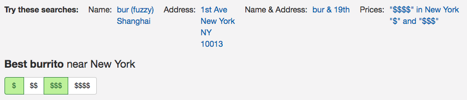
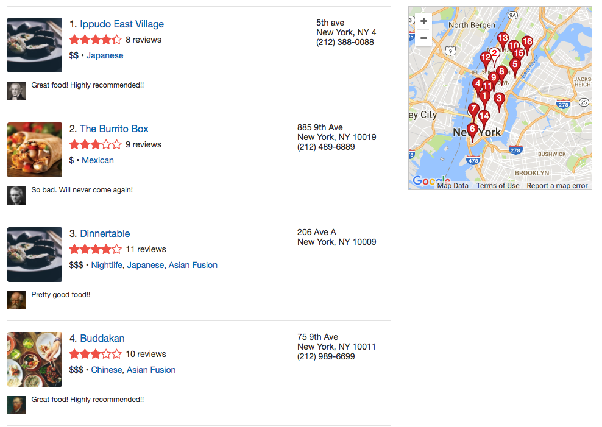
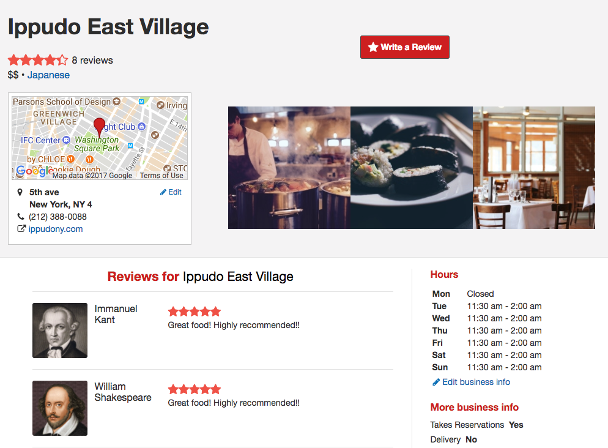
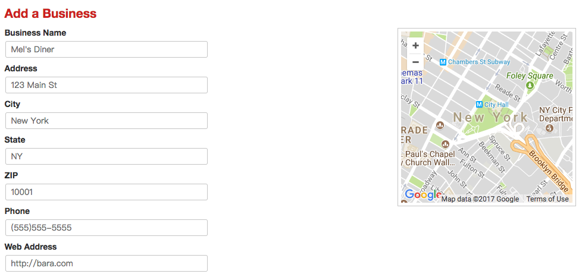
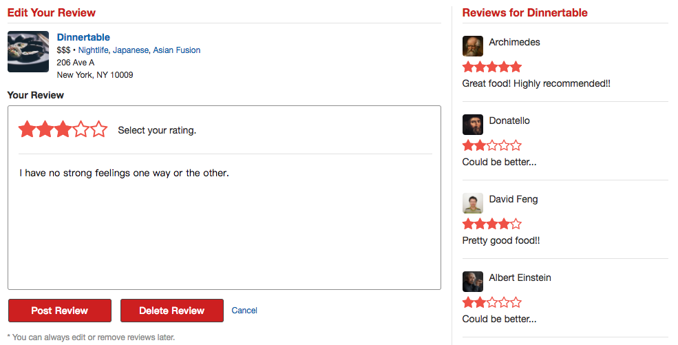
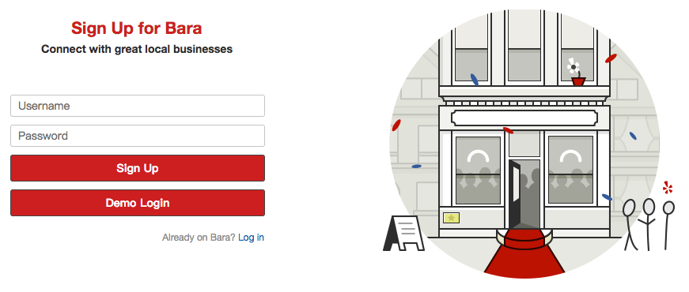

# Bara
[Live](https://bara.davidfeng.us/#/)

Bara is a Yelp-inspired single-page web app where users can CRUD businesses and reviews. It is built with React.js, Redux, Ruby on Rails, and a PostgreSQL database.


## Features
* Each React component loads data from the backend based on URL, not from the Redux store, therefore the user can directly visit a specific page (a particular business or a business search result), and users can share pages by their URLs.
* Businesses can be searched by its name, address, city, state, zipcode, price range, tags, and their combinations.
* The business show page displays a specific business and its reviews.
* When logged in, a user can create/update/delete businesses and reviews. For demonstration purposes, there are no constraints for operations on businesses, i.e. any user can add businesses and edit/delete any existing businesses. (In reality, you probably do not want to allow that!) On the other hand, a user can only review a business once, and only the author is allowed to edit/delete a review.

## Implementation Details
* [Homepage](#homepage)
* [Business search](#business-search)
  * [Search bar](#search-bar)
  * [Sample searches and price filters](#sample-searches-and-price-filters)
  * [Search component](#search-component)
  * [Business tags](#busienss-tags)
  * [Index map](#index-map)
* [Business show](#business-show)
* [Forms](#forms)
  * [Business form](#busienss-form)
    * [Latitude and longitude](#latitude-and-longitude)
  * [Review form](#review-form)
    * [Review constraints](#review-constraints)
  * [Session form](#session-form)
* [404](#404)
* [More docs](#more-docs)

### Homepage
The homepage contains a `Featured Businesses` section, which displays three random businesses. Clicking on the bara logo updates them. To implement this feature, I added collection route called `feature` and set up corresponding controller and view. Clicking the bara logo sends a GET request to `/api/businesses/feature`, which will send back the information of three random businesses.
```ruby
# config/routes.rb
resources :businesses, only: %i[index show create update destroy] do
  get 'feature', on: :collection
end

# app/controllers/api/businesses_controller.rb
def feature
  @businesses = Business.all.sample(3)
  render 'api/businesses/feature'
end

# app/views/api/businesses/feature.json.jbuilder
json.array! @businesses do |biz|
  json.partial! 'api/businesses/business', business: biz
end
```
The homepage also contains a search bar component, which is the same search bar component in the header of other pages (business search, business show, etc.) See details in the next section.

\>\> Return to [Implementation Details](#implementation-details)

### Business search

#### Search bar


The search bar has two fields, `name` and `location`, which are filled based on query string (`?name=bur&location=19th`) in the URL (e.g. `https://bara.davidfeng.us/#/businesses/?name=bur&location=19th`) in the `constructor` and `componentWillReceiveProps`. Therefore in a search page, the search bar input fields are filled with those queries.
Upon submission, the search bar pushes `/businesses/?name=${nameEncoded}&location=${locationEncoded}` to the history. Notice that the two fields are encoded using `encodeURIComponent`.

\>\> Return to [Implementation Details](#implementation-details)

#### Sample searches and price filter


Some links are provided for the user to try the search functionality.
The price filter fetches all the current filters (`name`, `location`, `tag`, current `prices[]`) from the URL, and adds/removes `prices[]` values when the user clicks on the dollar sign buttons. The updated search result will show up after the click. No need to click the submit button. Also, it is possible to select multiple `prices[]` values (e.g. "$" and "$$$$", which translates to `prices[]=1&prices[]=4` in the query string).

\>\> Return to [Implementation Details](#implementation-details)

#### Search component


The search component first set the `loaded` field in its state to be `false`, which displays the loading spinner. Then it gets all the filters (`name`, `location`, `tag`, `prices[]`) from the URL, send them to the backend, and the business index route handles the search and sends back the information of matched businesses (see below). Then the search component displays those businesses.
```ruby
def index
  businesses = Business.all.includes(:reviews, :tags)

  # search by the tag
  if params[:tag] && Tag.find_by(label: params[:tag].split.map(&:capitalize).join(' '))
    businesses = Tag.find_by(label: params[:tag].split.map(&:capitalize).join(' ')).businesses
  end

  # search by the name
  if params[:name] && params[:name] != ''
    businesses =
      businesses.where('lower(name) LIKE ?', "%#{params[:name].downcase}%")
  end

  # search by the location
  if params[:location] && params[:location] != ''
    businesses =
      businesses.where('lower(address) LIKE ?', "%#{params[:location].downcase}%")
                .or(businesses.where('lower(city) LIKE ?', "%#{params[:location].downcase}%"))
                .or(businesses.where('lower(state) LIKE ?', "%#{params[:location].downcase}%"))
                .or(businesses.where('zipcode = ?', params[:location].to_i))
  end

  # search by the prices
  if params[:prices] && params[:prices] != ''
    prices_numbers = params[:prices].map(&:to_i)
    businesses = businesses.where(price: prices_numbers)
  end

  # include the latest review, which is shown on the search page
  @businesses = businesses.includes(latest_reviews: [:author]).order(updated_at: :desc)
  render 'api/businesses/index'
end
```
\>\> Return to [Implementation Details](#implementation-details)
#### Business tags
Businesses and tags (e.g. `Chinese`, `Japanese`, `Nightlife`) have a many-to-many relationship. Thus the database has a `taggings` joint table to handle it. In the search result entries, the tag links of each business are shown next to its price range (dollar sign). Click on the tag link would fire a new search to fetch all the businesses with that tag.
\>\> Return to [Implementation Details](#implementation-details)
#### Index map
The index map is wrapped in a div, which has a `sticky` CSS position property so that when scrolling down the page, the map is always on the page.
When a business index entry is hovered, the business is *highlighted*, and the corresponding icon on the map should change to a different style. Instead of passing the highlighted business' id and the `highlightBusiness` action amongst all the relevant components, Redux is used to store the highlight. See the graph below for details.
```
SearchContainer
│ (map highlightBusiness action to props)
│
Search
│ (change the highlight to -1 before unmounting)
│
└───BusinessIndex
│   │
│   └───BusinessIndexItemContainer
│       │ (map highlightBusiness action to props)
│       │
│       BusinessIndexItem
│         (change the highlight to the business.id onMouseEnter,
│          change it to -1 onMouseLeave)
│
└───IndexMapContainer
    │ (map highlight in Redux store to props)
    │
    IndexMap
      (change the style of highlighted business icon)
```
\>\> Return to [Implementation Details](#implementation-details)

### Business show


The path for the business show page is `/businesses/:id`. In `componentDidMount` and `componentWillReceiveProps`, the component fetches business and its reviews from the backend and displays them. Right now each business has one image, and the business show page displays that image with two other default images. If something goes wrong, it displays the errors instead.

\>\> Return to [Implementation Details](#implementation-details)

### Forms
Bara has three form components: business form to create/edit businesses, review form to create/edit reviews, and session form to signup/login.
The business form and review form are rendered by `ProtectedRoute`, which means the user needs to login to view these components. The session form is rendered by `AuthRoute`, which can only be viewed if no user is logged in. At the backend, the corresponding `before_action` filters are added to those controller actions.
Since each form has two functions and can be accessed in two paths, the general working mechanism is:
1. Determine the form type based on the path (e.g. create or edit the business) in `componentDidMount` and `componentWillReceiveProps`. `componentWillReceiveProps` is needed because the user may go from one form to the other (e.g. signup form to login form or vice versa, or even edit business form for different businesses). Although such cases are relatively rare for business form and review form, they are taken care of.
2. If needed, fetch relevant information from backend and display them on the page or populate the input fields.
3. Upon form submission, package the data from input fields and call the corresponding util method to send the information to the backend.

\>\> Return to [Implementation Details](#implementation-details)
#### Business form


The business form component can be accessed by two paths:
* `/businesses/new` for create business form
* `/businesses/:id/edit` for edit business form

First, in `componentDidMount` and `componentWillReceiveProps`, the component determines the form type based on the path.

Then for the create business form, it populates the input fields with default values. For the edit business form, it fetches the business information from the backend and populates the input fields accordingly.

Upon form submission, it sends the information to the backend and redirects to the business show page. Right now newly created businesses have a default image. If anything goes wrong in this process (e.g. cannot find the business, the address is invalid, etc.), errors will be shown.

##### Latitude and longitude
People generally do not know or communicate the location with latitude and longitude, but they are used by Google maps to place a marker for the business.
When the user clicks the submit button, the form sends the full address (combination of `address`, `city`, `state` fields) to the Google Maps Geocoding API, which returns the corresponding latitude and longitude if the address is valid. Then the coordinates, with other information from the input fields are sent to the backend and stored in the database.

\>\> Return to [Implementation Details](#implementation-details)
#### Review form


The review form component can be accessed by two paths:
* `/businesses/:business_id/reviews/new` for create review form
* `/businesses/:business_id/reviews/new` for edit review form

The general pattern is the same as the business form.

First, in `componentDidMount` and `componentWillReceiveProps`, the component determines the form type based on the path.

Fetch information is a little trickier than the business form. For the create review form, it extracts the `business_id` from the path, fetches that business' information from the backend, and displays the information and latest 5 reviews on the page. For the edit review form, it extracts the id of the review to be edited from the path, fetches that review's information from the backend, including the review's `business_id`. Then (using JavaScript Promises) it fetches the business' information from the backend. Finally, it shows the relevant information on the page and populates the form input fields.

Upon form submission, it sends the information to the backend and redirects to the business show page.

##### Review constraints
I arbitrarily implemented the following two (reasonable) constraints for the reviews:

###### A user can only review a business once.
  1. The business show page

  The user access the create review form from the 'Write a Review' link on the business show page. If the current user already reviewed this business, this link becomes 'Edit My Review' link to the edit review form.

  To implement this, first, I let the business show container passes the current user to the business show component. Then on the backend, in the business show views, I created a reviewers field, whose value is a JavaScript object (Ruby hash) with reviewers' id as keys and the reviews' id as values.

  ```ruby
json.reviewers Hash[@business.reviews.map { |review| [review.author_id, review.id] }]
```
  So after business show fetches the business information from the backend, it just checks if the current user's id is a key in the reviewers object. If it is, then this user has already reviewed this business, and it can have the review's id right away, which makes building the path to the edit review trivial.

  Alternatively, I could have included all the reviewed businesses' ids and the reviews' ids in the user show view.

  2. The create review form

  Instead of access the intended review form by clicking on the link on the business show page, if the user types the create review form's URL in the browser, the create review will do the same thing based on the same mechanism: it fetches the business, then if it finds that the current user has already reviewed this business, it redirects to the edit review form.

  3. Backend: model-level validation and database-level constraints

  In the `Review` class, ActiveRecord validates the `author_id` scoped uniqueness of `business_id`, and a corresponding unique constraint is also added in the database migration.

###### Only the author is allowed to edit/delete the review.
  1. The business show page

  The 'Edit My Review' link at the top of the business show page leads to current user's edit review form. The 'Edit Review' Link in the review index item only appears if current user exists (someone is logged in) and the current user is the author of the review.

  2. The edit review form

  Instead of access the intended edit review form by clicking on the link on the business show page, if the user types the edit review form's URL in the browser, the edit review form will fetch the review from the backend based on the URL. If the review's author_id is not the same as the current user's id, it will return an error message.

  3. Backend: `ReviewsController`

  In the `ReviewsController`, the `update` method tries to find the review from the reviews of the current user and update it. Therefore, it will not find reviews authored by other users. Thus, it will return an error to the frontend. The same applies to the `destroy` method.

\>\> Return to [Implementation Details](#implementation-details)

#### Session form


The session form component can be accessed by two paths:
* `/login` for login form
* `/signup` for signup form

The general pattern for the forms still holds. The container component determines the form type based on the path and passes it to the presentational component. Upon form submission, the presentational component sends the information to the backend, logs in the user (even if you filled the signup form), and redirects to the previous page (it is likely that the user lands on the login page because he/she tries to access a `ProtectedRoute` without logging in).

If the user is created successfully, it will be assigned to a default avatar (handled by Amazon Web Services and Paperclip gem). After logging in, the avatar appears on the top right, which reveals a drop-down box containing more user information upon clicking.

\>\> Return to [Implementation Details](#implementation-details)

### 404


Bara has a 404 page if the URL does not match the routes of previous components.

\>\> Return to [Implementation Details](#implementation-details)

### More Docs

* [Frontend: React Component Hierarchy](docs/component-hierarchy.md)
* [Frontend: Redux Sample State](docs/sample-state.md)
* [Backend: Rails API Endpoints](docs/api-endpoints.md)
* [Database: Schema](docs/schema.md)

\>\> Return to [Implementation Details](#implementation-details)

## Possible Extension Directions

### Better business search

More filter options (e.g. filter by average rating) and more ways to sort search results (e.g. by created/updated time, average rating, number of reviews, price, etc.)

### Reviews tags and sorting

On the business show page, reviews can be tagged (e.g. funny, cool, useful etc.) and sorted in different ways (e.g. by the number of `useful` tag).

### User profile
The user profile page allows the user to change avatar, shows all the activities of the user (e.g. posting reviews), and all the content created by the user.

### Favorite businesses
A user should be able to store a business to a favorite list. The user might be able to create other lists.

### Friends
Users can have friendships with other users, and a news feed can be generated from the activities of friends.

### Business form
Users can add more pictures for a specific business.

## Credits
* Design: [Yelp](https://www.yelp.com/nyc)
* Web Developer: [Ge "David" Feng](https://davidfeng.us/)
* Icons: [Font Awesome](http://fontawesome.io/)
* Bara logo designer: [Meng Zhang](https://www.linkedin.com/in/meng-zhang-692b7644/)
