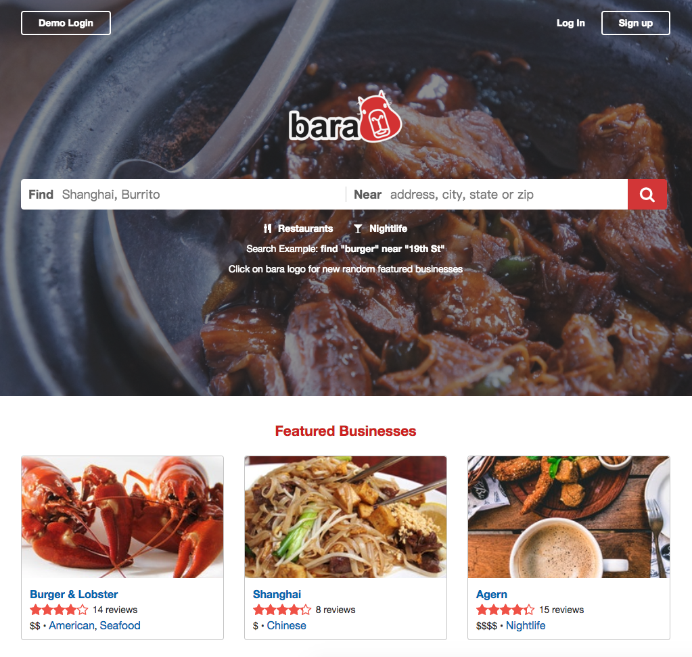

# Bara
[Live](https://bara.davidfeng.us/#/)

Bara is a Yelp-inspired single-page web app where users can CRUD businesses and reviews. It is built with React.js, Redux, Ruby on Rails, and a PostgreSQL database.

## Update 4/2/2018: refactored homepage
I have completely refactored the frontend React code for the homepage ([Take a look!](frontend/components/home/HomeContainer.jsx) [Here](https://codeburst.io/clean-code-in-react-fe11372f331c) is a Medium story about the process). Compared to the original version, now the code is easier to read, has no ESLint errors, and we have some snapshot tests (`npm test`). However, currently I do not have time to work on other parts of the frontend. Hopefully I can get back to it in the future.

## Features
* Each React component loads data from the backend based on URL, not from the Redux store, therefore the user can directly visit a specific page by its URL (the business search page with certain filters or the business show page of a particular business), and users can share pages by their URLs.
* Businesses can be searched by its name, address, city, state, zipcode, price range, tags, and their combinations.
* When logged in, a user can create/update/delete businesses and reviews. For demonstration purposes, there are no constraints for operations on businesses, i.e. any user can add businesses and edit/delete any existing businesses. (In reality, you probably do not want to allow that!) On the other hand, a user can only review a business once, and only the author is allowed to edit/delete a review.
* The business form fetches the latitude and longitude based on address using the Google Maps Geocoding API.

## Implementation
* [Overview and Details](docs/implementation.md)
* [Frontend: React Component Hierarchy](docs/component-hierarchy.md)
* [Frontend: Redux Sample State](docs/sample-state.md)
* [Backend: Rails API Endpoints](docs/api-endpoints.md)
* [Database: Schema](docs/schema.md)

## Credits
* Design: [Yelp](https://www.yelp.com/nyc)
* Web Developer: [Ge "David" Feng](https://davidfeng.us/)
* Icons: [Font Awesome](http://fontawesome.io/)
* Bara logo designer: [Meng Zhang](https://www.linkedin.com/in/meng-zhang-692b7644/)
