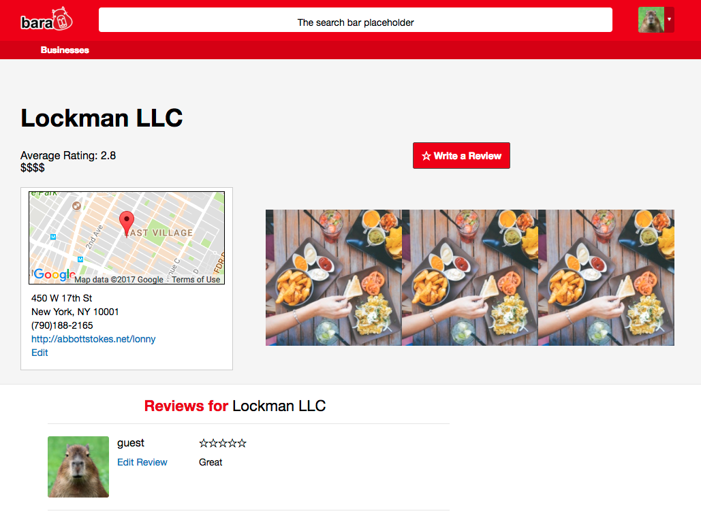

# Bara

[Bara live][Heroku]

[Heroku]: https://bara.davidfeng.us/#/

Bara is a full-stack web application which clones several basic features of Yelp. On the back-end, Bara utilizes Ruby on Rails and a PostgreSQL database; on the front-end, it uses React.js with a Redux architectural framework.  

## Features & Implementation

### 1. User creation and authentication
When a user is created, on the back-end,  passwords are hashed by bcrypt and the resulting hash is stored in the database.
If there is an error in the user creation (e.g. username has been taken), the backend will send the error messages to the front-end, which will be rendered in an ErrorList React component. The errors can be dismissed.
If the user is created successfully, it will be assigned to a default avatar (handled by Amazon Web Services and Paperclip gem).
After logging in, the avatar appears on the top right, which reveals a drop-down box containing more user information upon clicking.

If no user is logged in, attempts to create/edit businesses/reviews will be redirected to the login page. The browser goes back to the previous page after logging in.

### 2. Business index page, map, price filter
The business index page contains basic information of each business. The average rating and the latest review will be updated after a new review is posted.
On the business index page, the user can filter the businesses by the price range. After the filter changes, the index entries and the markers on the map will update accordingly. Filters can be reset.

### 3. Business show page
Business show page contains details, a map, an edit link, and reviews for a business. Reviews are ordered reversely by their creation time.

### 4. Business form
When a business is created, Bara sends the full address (combines the `address`, `city`, `state` columns in the `businesses` table) to the Google Maps Geocoding API, which returns the latitude and longitude. The `lat` and `lng` columns are then updated. The coordinates are then used to set up the center of the map and to place a marker on it.

## Future Directions

### Business filters/sorting/search
I plan to make more filters in the business index page, e.g. filter by average rating.
Businesses should be able to be sorted in multiple ways (e.g. creating time, average rating, price, etc.)
Business search can be implemented using existing libraries (e.g. Fuse.js, PgSearch gem).  

### Reviews tags and sorting
On the business show page, reviews can be tagged (e.g. funny, cool, useful etc.) and sorted in different ways (e.g. by number of useful tags).

### User Profile
The user profile page allows the user to change avatar, shows all the activities of the user (e.g. posting reviews), and all the content created by the user.

### Favorite Businesses
A user should be able to store a business to a favorite list. The user might be able to create other lists.

### Friends
Users can be friend with other users, and a news feed can be generated from the friends' activities.
